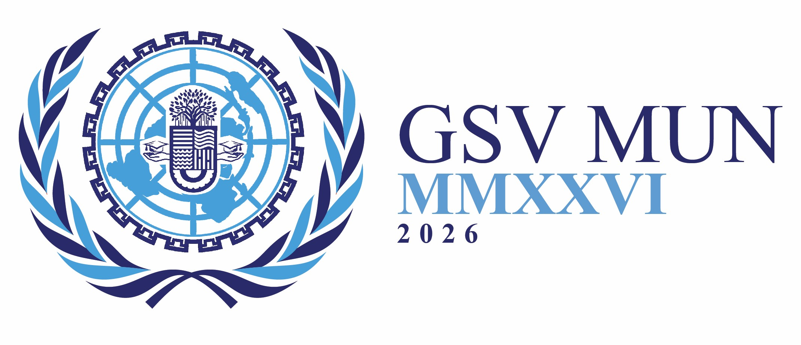

# GSV Model United Nations 2026 - Official Website



The official web platform for the inaugural **GSV Model United Nations
2026**. Organized by the Debate & Quiz Club, this conference is a
flagship event of **EPITOME 2026**, the premier annual technical
festival of Gati Shakti Vishwavidyalaya.

This website serves as the central hub for delegate registration,
committee information, rules of procedure, and event logistics.

---

## 🌟 Key Features

- **Premium Custom UI:** A bespoke, UN-inspired design language
  utilizing a sophisticated dark indigo and bright cyan color palette
  matched to the official GSV MUN branding.
- **Fully Responsive:** A custom-built mobile navigation system
  (hamburger menu) and responsive CSS grids ensure the site looks
  flawless on desktops, tablets, and smartphones.
- **Performance Optimized:** Built with pure HTML, CSS, and Vanilla
  JavaScript. No heavy frameworks or libraries, ensuring
  lightning-fast load times.
- **Interactive Elements:** Smooth scroll-reveal animations, dynamic
  hover states on cards, and an interactive FAQ accordion.
- **Modular Architecture:** Shared CSS and JavaScript files across all
  pages for easy maintenance and global style updates.

---

## 🛠️ Tech Stack

- **Markup:** HTML5\
- **Styling:** CSS3 (CSS Variables, Flexbox, CSS Grid, Media Queries)\
- **Interactivity:** Vanilla JavaScript (ES6)\
- **Typography:** [Google Fonts](https://fonts.google.com/)
  - `Playfair Display` for headings\
  - `Inter` for body copy\
- **Icons:** [FontAwesome 6.4.0](https://fontawesome.com/)

---

## 📂 Project Structure

    /gsv-mun
    │
    ├── index.html            # Landing page (Hero, SG Message, Event Highlights)
    ├── about-mun.html        # Introduction to MUN concepts for beginners
    ├── committee.html        # UNGA DISEC mandate, agenda, and geopolitical context
    ├── rules.html            # Detailed parliamentary rules and general instructions
    ├── secretariat.html      # Organising Committee, Executive Board, and Volunteers
    ├── faq.html              # Interactive Frequently Asked Questions accordion
    ├── register.html         # Registration portal and deadlines
    │
    ├── style.css             # Global stylesheet and responsive design rules
    ├── script.js             # Sticky navbar, mobile menu, animations, and accordion logic
    │
    └── /images               # Directory for all image assets

---

## 🎨 Design System & Branding

The website uses a strict color palette extracted from the official GSV
MUN and EPITOME 2026 branding. These are defined as CSS variables in
`style.css` for easy management:

- **Primary Dark Blue:** `#1D2266` (`--logo-dark-blue`)\
  Used for headers, primary text, and the hero background.

- **Accent Bright Cyan:** `#00A8E8` (`--logo-bright-blue`)\
  Used for borders, hover effects, icons, and call-to-action
  highlights.

- **Background Light:** `#fcfcfd` (`--bg-light`)\
  The primary page background.

- **Text Body:** `#4a5568` (`--text-body`)\
  Optimized for high readability during long research sessions.

---

## 🚀 Getting Started (Development)

### Clone the repository

```bash
git clone https://github.com/Parth-Sidhu-4/gsv-mun.git
```

### Navigate to the project directory

```bash
cd gsv-mun
```

### Run locally

Since this is a static website, no build step is required.

Simply open `index.html` in your preferred web browser, or use the **VS
Code Live Server extension** for hot-reloading during development.

---

## 📅 Event Details

**Event:** GSV Model United Nations 2026\
**Host:** Debate & Quiz Club, Gati Shakti Vishwavidyalaya\
**Fest:** EPITOME 2026

**Committee:**\
United Nations General Assembly -- Disarmament and International
Security Committee (UNGA DISEC)

**Agenda:**\
Addressing the Rise of Hybrid Warfare in Contemporary Regional
Conflicts: Proxy Warfare and Cross-Border Terrorism

---

## ✉️ Contact & Support

For technical issues regarding this website or inquiries regarding the
event, please reach out to the Organising Committee.

**Email:** debate.quiz@gsv.ac.in\
**Instagram:** @d.q.gsv\
**LinkedIn:** Debate & Quiz Club, GSV

---

Designed and developed for the inaugural **GSV Model United Nations** by [Parth Sidhu](https://github.com/Parth-Sidhu-4).
Maintained by Debate And Quiz Club, Gati Shakti Vishwavidyalaya.
